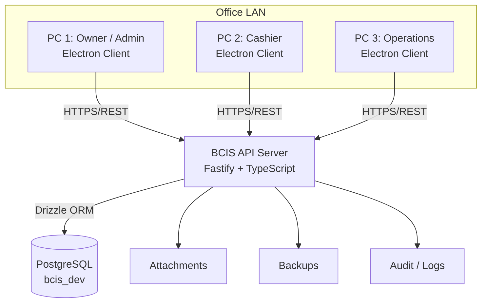

# BCIS Architecture

## Key rules

- Electron renderers never connect to PostgreSQL directly — all data access goes through the API.
- `contextIsolation: true` and `nodeIntegration: false` are enforced in every Electron window.
- All external input is validated with Zod before reaching business logic.
- Financial mutations are transactional and produce audit records; nothing is silently deleted.